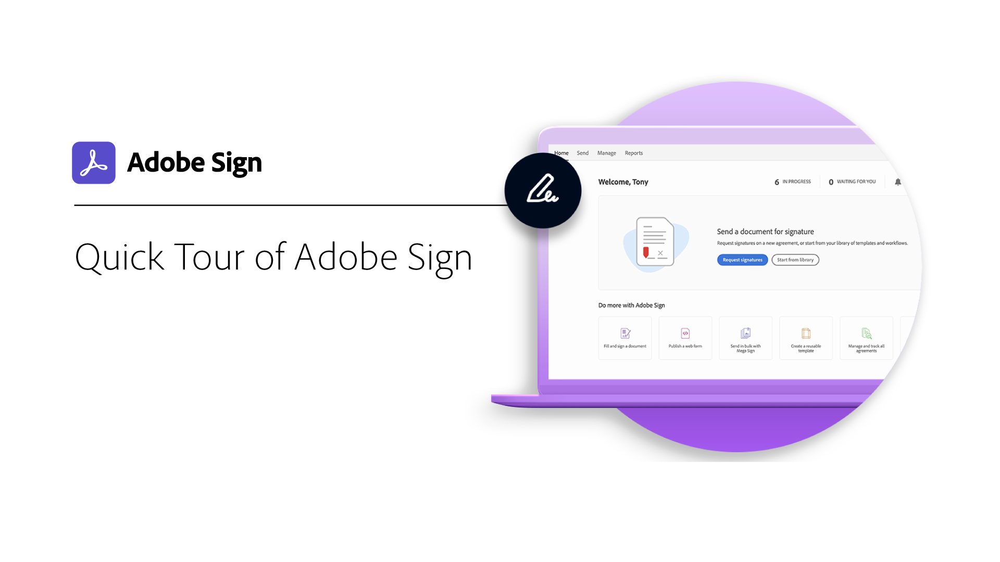

# Présentation de la prise en main

Découvrez rapidement comment envoyer des documents, les signer et en effectuer le suivi à l’aide de ces courts tutoriels détaillés. Visitez rapidement Adobe Sign, puis envoyez un document à une ou plusieurs personnes. Ce contenu est conçu pour faciliter les processus de signature électronique.

## Envoi

<table style="table-layout:fixed">
<tr>
 <td>
    
    

    <a href="quick-tour.md"><strong>Visite rapide d'Adobe Sign</strong></a>
    

    <em>Visitez rapidement l'interface d'Adobe Sign pour vous familiariser</em>
     
  </td>
  <td>
    
    

    <a href="send-to-single-recipient.md"><strong>Envoi à un destinataire unique</strong></a>
    

    <em>Rendez-vous et découvrez à quel point il est facile d’envoyer un document pour signature.</em>
     
  </td>
  <td>
    
    

    <a href="send-to-multiple-recipients.md"><strong>Envoi à plusieurs destinataires</strong></a>
    

    <em>Envoyer un document pour signature électronique à plus d’une personne dans l’ordre exact souhaité</em>
     
  </td>
</tr>
<tr>
  <td>
    
    

    <a href="new-sender.md"><strong>Prise en main d’Adobe Sign pour les nouveaux expéditeurs</strong></a>
    

    <em>Ce tutoriel complet est un excellent point de départ pour les nouveaux expéditeurs d'Adobe Sign.</em>
     
  </td>
  <td>
    
    

     
  </td>
  <td>
    
    

     
  </td>
</tr>
</table>

## Signing

<table style="table-layout:fixed">
<tr>
  <td>
    
    

    <a href="electronically-sign-a-document.md"><strong>Signature électronique d’un document</strong></a>
    

    <em>Découvrez à quel point il est facile de signer un document qui vous a été envoyé avec Adobe Sign</em>
     
  </td>
  <td>
    
    

    <a href="fill-and-sign.md"><strong>Remplissage et signature d’un document</strong></a>
    

    <em>Remplissez les formulaires et ajoutez votre signature électronique aux documents.</em>
     
  </td>
  <td>
    
    

    <a href="sign-in-person.md"><strong>Obtention d’une signature en personne</strong></a>
    

    <em>Obtenir la signature de quelqu'un d'autre en personne à l'aide de l'application mobile Adobe Sign</em>
     
  </td>
</tr>
<tr>
  <td>
    
    

    <a href="sign-with-a-digital-signature.md"><strong>Qu’est-ce qu’une signature numérique ?</strong></a>
    

    <em>En savoir plus sur les signatures numériques basées sur certificat</em>
     
  </td>
  <td>
    
    

    <a href="sign-with-a-stamp.md"><strong>Signature à l’aide d’un tampon</strong></a>
    

    <em>Utiliser des tampons pour marquer un document approuvé ou complété</em>
      
  </td> 
  <td>
    
    

     
  </td>
</tr>  
</table>

## Gestion

<table style="table-layout:fixed">
<tr>
  <td>
    
    

    <a href="manage-and-track.md"><strong>Gestion et suivi des documents</strong></a>
    

    <em>Gestion et suivi des accords que vous avez envoyés pour signature</em>
     
  </td>
  <td>
    
    

    <a href="../sign-advanced-users/create-a-template.md"><strong>Création d’un modèle de document</strong></a>
    

    <em>Création d’un modèle de document réutilisable pour garantir la rapidité et la cohérence de votre entreprise</em>
     
  </td>
  <td>
    
    

    <a href="modify-in-flight.md"><strong>Modification d’un document déjà envoyé pour signature</strong></a>
    

     
    <em>Modification du flux de travaux d’un document déjà en cours</em>
  </td>
</tr>
</table>
