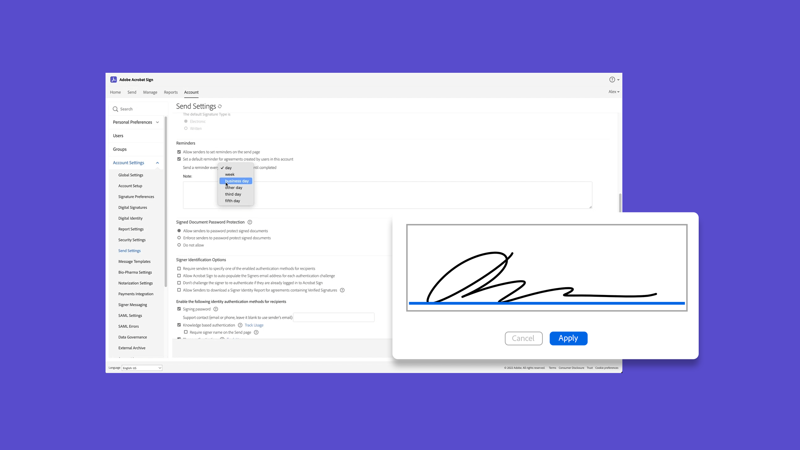

# Présentation de la prise en main

Découvrez comment envoyer, signer et suivre des documents à l’aide de ces courts tutoriels détaillés. Découvrez rapidement Acrobat Sign, puis passez à l’envoi d’un document à une ou plusieurs personnes. Ce contenu est conçu pour vous faciliter l’utilisation des workflows de signature électronique.

## Nouveautés

>[!BEGINTABS]

>[!TAB Signer électroniquement un document]

Découvrez combien il est facile de [signer](../sign-beginner-tutorials/electronically-sign-a-document.md) un document qui vous est envoyé avec Acrobat Sign.

>[!TAB Créer un modèle réutilisable]

Découvrez comment créer un [modèle de document réutilisable](../sign-advanced-users/create-a-template.md).

>[!TAB Configurer les options d’envoi]

Découvrez comment [configurer différentes options](sending-options.md) lors de l&#39;envoi d&#39;un document pour signature.

>[!TAB Envoyer à plusieurs signataires]

Découvrez comment envoyer un document pour signature électronique à [plus d&#39;une personne](send-to-multiple-recipients.md) dans l&#39;ordre exact que vous souhaitez.

>[!ENDTABS]

## Send

<table style="table-layout:fixed">
<tr>
  <td>
    
    

    <a href="new-sender.md"><strong>Prise en main d'Acrobat Sign</strong></a>
    

    Ce tutoriel est un excellent point de départ pour les nouveaux utilisateurs d’Acrobat Sign
     
  </td>
 <td>
    
    

    <a href="quick-tour.md"><strong>Concepts de base de l'espace de travail</strong></a>
    

    Découvrir rapidement l’espace de travail d’Acrobat Sign pour prendre en main votre application
     
  </td>
  <td>
    
    

    <a href="send-to-single-recipient.md"><strong>Envoyer un document à un seul signataire</strong></a>
    

    Intervenez et découvrez à quel point il est facile d’envoyer un document pour signature
     
  </td>
  <td>
    
    

    <a href="send-to-multiple-recipients.md"><strong>Envoyer à plusieurs signataires</strong></a>
    

    Envoyez un document pour signature électronique à plusieurs personnes dans l’ordre exact souhaité
     
  </td>
</tr>
<tr>
  <td>
    
    

    <a href="sending-options.md"><strong>Configurer les options d’envoi</strong></a>
    

    Découvrez comment configurer différentes options lors de l’envoi d’un document pour signature
     
  </td>
  <td>
    
    

    <a href="adding-fields.md"><strong>Ajout de champs à vos documents</strong></a>
    

    Découvrez comment ajouter différents types de champs à vos documents
     
  </td>
  <td>
    
    

    <a href="modify-in-flight.md"><strong>Modification d'un document après l'envoi</strong></a>
    

    Modification d’un document déjà en cours
     
  </td>
  <td>
    
    

    <a href="replace-signer.md"><strong>Remplacement d’un signataire</strong></a>
    

    Découvrez comment modifier le signataire d’un document déjà en cours
      
  </td>
</tr>
<tr>
  <td>
      
      

      <a href="set-deadlines-reminders.md"><strong>Définir des échéances et des rappels</strong></a>
      

      Découvrez comment envoyer régulièrement des rappels par e-mail et connaître les dates limites pour que vos documents soient signés rapidement
       
    </td> 
  <td>
    
    

    <a href="../sign-advanced-users/create-a-template.md"><strong>Créer un modèle réutilisable</strong></a>
    

    Créez un modèle de document réutilisable pour offrir rapidité et cohérence à votre entreprise
     
  </td>
    <td>
      
      

       
    </td>
    <td>
      
      

       
    </td>
</tr>
</table>

## Signer

<table style="table-layout:fixed">
<tr>
  <td>
    
    

    <a href="electronically-sign-a-document.md"><strong>Signer électroniquement un document</strong></a>
    

    Découvrez combien il est facile de signer un document qui vous est envoyé avec Acrobat Sign
     
  </td>
  <td>
    
    

    <a href="fill-and-sign.md"><strong>Remplissage et signature d'un document</strong></a>
    

    Remplir des formulaires et ajouter votre signature électronique aux documents
     
  </td>
  <td>
    
    

    <a href="sign-in-person.md"><strong>Obtention d’une signature en personne</strong></a>
    

    Obtenir la signature de quelqu’un d’autre en personne à l’aide de l’application mobile Acrobat Sign
     
  </td>
  <td>
    
    

    <a href="delegate-signing.md"><strong>Déléguer la signature à quelqu’un d’autre</strong></a>
    

    Découvrez comment déléguer la signature d’un document à une autre personne
     
  </td>
</tr>
<tr>
  <td>
    
    

    <a href="sign-with-a-digital-signature.md"><strong>Qu’est-ce qu’une signature numérique</strong></a>
    

    En savoir plus sur les signatures numériques basées sur certificat
     
  </td>
  <td>
    
    

    <a href="sign-with-a-stamp.md"><strong>Signature à l’aide d’un tampon</strong></a>
    

    Utiliser des tampons pour marquer un document approuvé ou terminé
      
  </td> 
 <td>
    
    

     
  </td>
  <td>
    
    

     
  </td>
</tr>  
</table>

## Gérer

<table style="table-layout:fixed">
<tr>
  <td>
    
    

    <a href="manage-and-track.md"><strong>Gérer et suivre vos accords</strong></a>
    

    Découvrez comment gérer et suivre les accords envoyés pour signature
     
  </td>
  <td>
    
    

     
  </td>
  <td>
    
    

     
  </td>
  <td>
    
    

     
  </td>
</tr>
</table>
