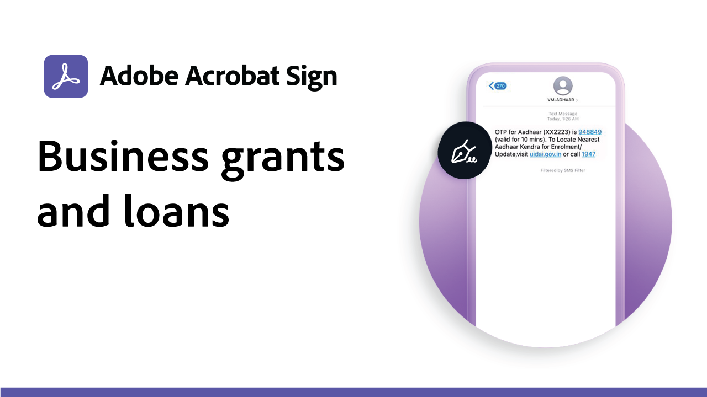

# Recettes de cas

Accélérez les workflows digitaux de votre entreprise avec ces exemples de signature électronique à usage gouvernemental et commercial. Cliquez ici pour afficher un PDF avec des ressources et des détails sur la configuration de ces cas d’utilisation de signature électronique spécifiques.

## Cas d’usage gouvernemental

<table style="table-layout:fixed">
<tr>
  <td>
    
    

    <a href="usecasegovgrants.md"><strong>Subventions et prêts aux entreprises</strong></a>
    

    <em>Aider rapidement les entreprises en leur offrant un accès libre-service aux formulaires de demande de subvention, de prêt et de report d'impôt</em>
     
  </td> 
  <td>
    
    

    <a href="usecasegovtelework.md"><strong>Accord de télétravail</strong></a>
    

    <em>Collectez efficacement les signatures de tous vos employés sur les contrats de télétravail, les mises à jour des stratégies, etc</em>
     
  </td>
  <td>
    
    

    <a href="usecasegovcontracts.md"><strong>Contrats et formulaires de demande</strong></a>
    

    <em>Remplacez rapidement le traitement papier par des workflows digitaux conformes, assortis de rapports d'audit</em>
     
  </td>
</tr>
<tr>
  <td>
    
    

    <a href="usecasegovreemployment.md"><strong>Assistance au réemploi</strong></a>
    

    <em>Aidez les administrés à obtenir l'aide dont ils ont besoin, sans être au point avec des formulaires d'inscription 100 % digitaux, qui peuvent être mis à disposition en quelques jours</em>
     
  </td>
  <td>
    
    

    <a href="usecasegovpaycheck.md"><strong>Protection Paycheck</strong></a>
    

    <em>Découvrez comment utiliser Acrobat Sign pour convertir le formulaire Payment Protection Program en formulaire interactif en ligne</em>
     
  </td>
  <td>
    
    

    <a href="usecasegovremote.md"><strong>Demande de mandat à distance</strong></a>
    

    <em>Collectez les signatures électroniques et les conférences web pour écourter les délais de traitement des demandes et sécuriser les mandats des juges</em>
     
  </td>
</tr>
</table>

## Cas d’usage commercial

<table style="table-layout:fixed">
<tr>
  <td>
    
    

    <a href="usecasecomcontracts.md"><strong>Contrats et formulaires de demande</strong></a>
    

    <em>Remplacez rapidement le traitement papier par des workflows digitaux conformes, assortis de rapports d'audit</em>
     
  </td> 
  <td>
    
    

    <a href="usecasecompolicy.md"><strong>Accords de stratégie</strong></a>
    

    <em>Collectez efficacement les signatures de tous vos employés sur les contrats et les mises à jour</em>
     
  </td>
  <td>
    
    

    <a href="usecasecomtelework.md"><strong>Accord de télétravail</strong></a>
    

    <em>Collectez efficacement les signatures de tous vos employés sur les contrats de télétravail</em>
     
  </td>
</tr>
</table>
