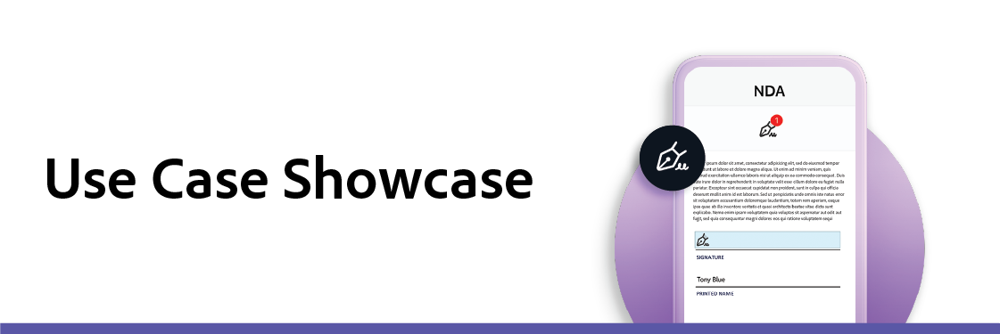

# Vitrine de cas

La présentation des cas d’usage est une session en direct qui vous présente les nouveaux cas d’usage et les nouvelles tendances concernant Acrobat Sign, et vous montre comment votre entreprise peut les mettre en oeuvre et en tirer parti. Chaque mois, une nouvelle rubrique est mise en évidence.

Vous trouverez ci-dessous des enregistrements ou des liens d’inscription pour les dernières sessions :

## Sessions 2021

* **[Le chemin d&#39;AbbVie vers la transformation digitale](https://use-case-showcase-with-abbvie.joinus.adobeevents.com/){target="_blank"}**
Date : 4 août 2021 La stratégie d&#39;AbbVie est de fournir des médicaments innovants et d&#39;avoir un impact remarquable sur la vie des gens. Afin d’accroître son agilité et de permettre aux collaborateurs de se concentrer sur des tâches plus complexes, l’entreprise s’efforce d’automatiser certains de ses processus métier. La transition vers l’abandon du papier et du stylo est une première étape essentielle. Rejoignez-nous pour discuter avec AbbVie de leurs objectifs, de leur stratégie et de leurs processus visant à garantir la réussite de la transformation digitale.

* **[Enregistrement à la demande avec Volvo Cars](https://gateway.on24.com/wcc/eh/2172296/lp/2963219/adobe-sign-use-case-showcase%3A-featuring-volvo-cars/){target="_blank"}**
Quel est l&#39;avenir du shopping automobile ? Pour le constructeur automobile suédois Volvo Cars, ils apportent des modifications à leur modèle d&#39;affaires qui influenceront les attentes des clients pour la prochaine génération d&#39;acheteurs de voitures. Au coeur de leur processus se trouve la capacité à fournir une expérience client de haute qualité pour correspondre à leurs offres premium.

Rejoignez-nous pour une conversation en coulisses avec Volvo Cars, qui expliquera comment ils ont pris de grandes idées et les ont transformées en réalités, et comment d&#39;autres entreprises peuvent apprendre de leurs expériences de transformation.

* **[5 Transformations prévues pour les administrations en matière d&#39;enregistrement à la demande en 2021](https://gateway.on24.com/wcc/eh/2172296/lp/2790280/5-ways-government-agencies-will-transform-in-2021-/){target="_blank"}**
Comment Acrobat Sign peut-il aider les organismes publics à mieux servir leurs administrés ? Citoyens et employés attendent désormais des expériences en ligne plus attrayantes. Et pour passer au digital, les processus administratifs doivent respecter des règles strictes de sécurité, de confidentialité et de conformité. Lorsque la pandémie s’est déclarée, les administrations ont dû accélérer leur transformation digitale pour continuer à répondre aux besoins de leurs administrés et assurer la continuité opérationnelle.

Rejoignez-nous pour la présentation des cas d’usage d’Acrobat Sign, durant laquelle des experts de l’administration présenteront les défis auxquels les administrations et les collectivités ont été confrontées, ainsi que les moyens qu’elles continuent à innover pour assurer leur continuité.

## Sessions 2020 par secteur

* **[Administration](https://event.on24.com/wcc/r/2790280/7FFF27458A6834FDF8C73C5149637590?partnerref=EXL){target="_blank"}**
Focus : Notre panel d’experts couvre les bonnes pratiques et divers cas d’usage spécifiques à l’administration pour vous montrer comment Acrobat Sign peut aider votre équipe à gagner du temps, à économiser de l’argent et des ressources, tout en restant en conformité et en sécurité.

* **[Juridique](https://event.on24.com/wcc/r/2634329/292CA0B317E56600A114508CC55376BF?partnerref=EXL){target="_blank"}**
Focus : Nos intervenants expliquent comment les services juridiques gèrent la transition vers des processus documentaires entièrement à distance. Que vous débutiez à peine, ou que vous ayez déjà dématérialisé certains workflows, Acrobat Sign peut amplifier la productivité de votre équipe à chaque étape de la transformation digitale.

* **[Ventes](https://acrobat.adobe.com/us/en/business/webinars/adobe-sign-use-case-showcase-sales.html){target="_blank"}**
Focus : Les experts en Adobe mettent en avant les meilleures pratiques pour réussir la transformation digitale des achats, et la discussion couvre les tendances du secteur et les exigences pour proposer d’excellentes expériences utilisateur.

* **[Achats et logistique](https://event.on24.com/wcc/r/2514418/278FB6F16C198E2B866CF487AF9514F6){target="_blank"}**
Focus : Le fonctionnement d’Acrobat Sign dans les domaines de l’approvisionnement et de la logistique

* **[Applications de RH](https://event.on24.com/wcc/r/2351937/D9E34A102F309DFCAF0D07D5192BD66D){target="_blank"}**
Focus : Fonctionnement d’Acrobat Sign dans diverses applications de RH.

* **[Administrations et collectivités locales](https://event.on24.com/wcc/r/2351937/D9E34A102F309DFCAF0D07D5192BD66D){target="_blank"}**
Focus : Fonctionnement d’Acrobat Sign dans les administrations et collectivités locales.

* **[Éducation](https://event.on24.com/wcc/r/2241711/762243D5EE65DAC44D3AE7BCCD3388A7){target="_blank"}**
Focus : Fonctionnement d’Acrobat Sign pour l’éducation.

* **[Life Science](https://event.on24.com/wcc/r/2204781/2C266134D08DDE48E17C77746F192AA6){target="_blank"}**
Focus : Comment Acrobat Sign fonctionne avec les sciences de la vie.

* **[Soins de santé](https://event.on24.com/wcc/r/2202626/1D60C42BD396AE273CB09CF53F1051BE){target="_blank"}**
Focus : Acrobat Sign au service de la santé. Les sujets incluent : utilisation croissante de la télésanté et de la transformation numérique - infrastructure et mise à l&#39;échelle.

* **[Services financiers](https://event.on24.com/wcc/r/2177152/40A4315A5D32F21AFB5EB03E25C15992){target="_blank"}**
Focus : Comment Acrobat Sign fonctionne pour le secteur bancaire. Les sujets incluent : tendances sectorielles en 2020 et au-delà, documents et processus digitaux dans le cadre plus large d’une transformation digitale, bonnes pratiques, cas d’usage et avantages d’Acrobat Sign.

* **[Assurances](https://event.on24.com/wcc/r/2162717/1449ED610AD3B545004079728D9AE0F6){target="_blank"}**
Focus : Comment Acrobat Sign fonctionne avec les services financiers et l’assurance ? Les sujets incluent : tendances du secteur, obligations règlementaires et de conformité dans le secteur financier, et fournir une excellente expérience client.
